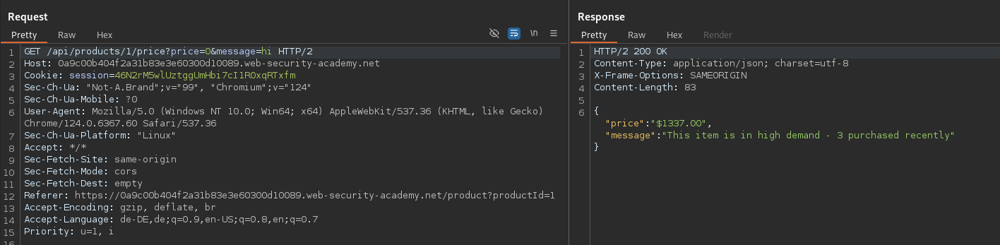

# Lab: Finding and exploiting an unused API endpoint

[Lab](https://portswigger.net/web-security/api-testing/lab-exploiting-unused-api-endpoint)

## Information Gathering

### Discovering API documentation

there doesn’t seem to be a API documentation in place.

### Discovering API Endpoints

### Examining API Endpoints

#### Change Parameters

#### Change HTTP methods

PATCH

This indicates, that the PATCH HTTP method is allowed.

Furthermore the HTTP method requires a application/json Content-Type

→ this looks like a potential attack surface

#### Examine the JSON Format

## Exploit

Boom 🪄

Move on adding the product to your cart and then purchase the item for free.

