# Lab: Exploiting a mass assignment vulnerability


## Information Gathering

### Discovering API Endpoints

Check Functionalities and take note of the URL paths. If they contain API it might indicate a API endpoint.

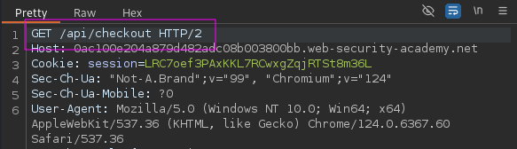

### Discovering API documentation

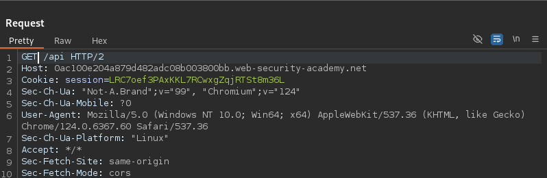

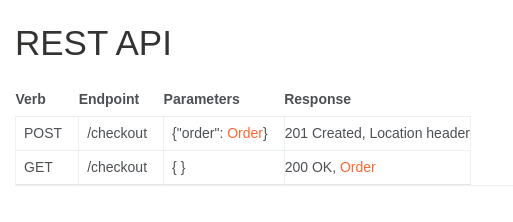

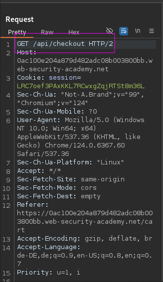

### Examine HTTP Methods

GET

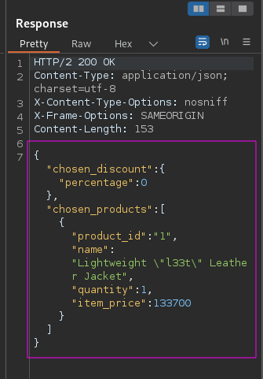

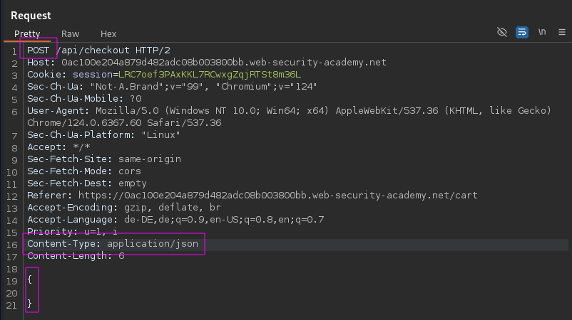

POST

In this request the Content-Type was changed to application/json and the body was given am empty json dataset.

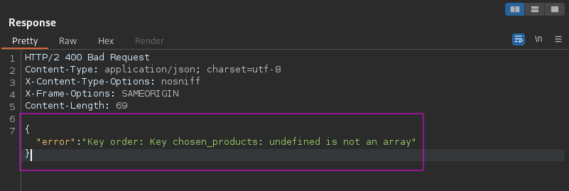

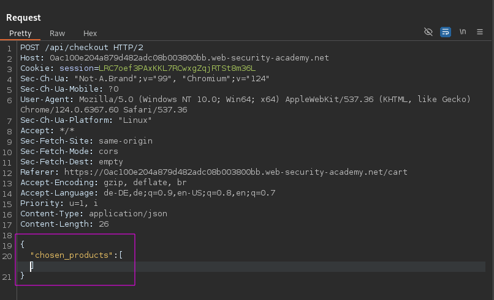

Comparing the response of the GET request with the response of the POST request, indicates that the json dataset within the POST request needs another data structure “chosen_products”.

Now we can build a custom data structure “open_products” inspired by the GET response data.

 We therefore could move on to the exploit section where we will craft our exploitation payload.

## Exploiting

First lets confirm, that the “chosen_products” data structure does get accepted by the endpoint.

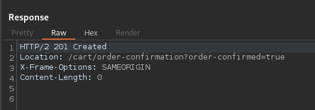

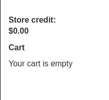

it does get accepted and resolves into an empty cart. This validates, that we can manipulate our card with the given endpoint

### Payload Construction

To construct the payload the GET response is helpful for determining the required key-value pairs of the object stored within our data structure.

```json
{
	"chosen_discount":
		{
			"percentage":100
		},
	"chosen_products":[
	{
		"product_id":"1",
		"quantity":1,
		"name":"Lightweight \"l33t\" Leather Jacket",
		"item_price":133700
	}	
]
```

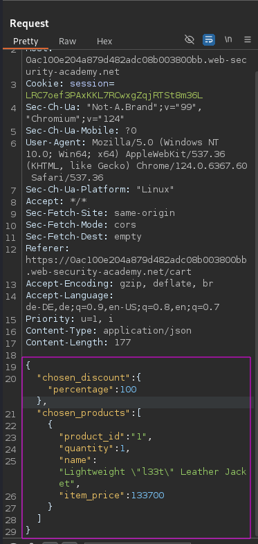

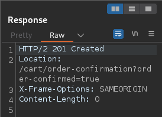

Success 🪄 We have a discount of 100% on the product. By exploiting a Mass Assignment Vulnerability. What a steal!